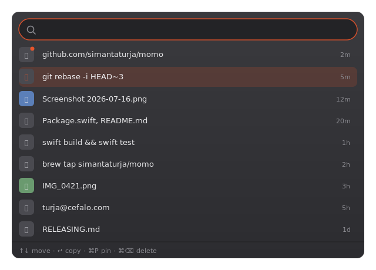

<div align="center">


# Momo

**A blazingly fast clipboard history for macOS that lives in your menu bar.**

Everything you copy — text, files, images — kept, searchable, and one keystroke away.
Native Swift + AppKit. No Electron. No lag. No telemetry.


</div>

<p align="center">
  <em>press ⌘⇧V, anywhere</em><br/>
  
</p>

---

## Why Momo

Clipboard managers have one job and two moments that matter: **the instant the popup
opens** and **the instant you start typing to find something**. Those are the only two
times a human actually waits. Momo is built around a single idea — *do zero expensive
work on those two paths* — and pushes everything else (persistence, pruning, image
decoding) off to the background.

The result is a utility that feels like it isn't there until you need it, then appears
and filters faster than you can think.

> Momo is named after the dumpling 🥟 — small, fast, and quietly satisfying. (Yes, the
> menu-bar icon is a dumpling.) It began life as **Pastal** and was renamed to Momo.

## Features

- ⚡ **Instant popup** — the panel is built once at launch and simply revealed, never
  rebuilt. Opening is a reveal, not an assembly.
- 🔎 **Instant fuzzy search** — filtering runs over an in-memory index; a keystroke never
  touches the disk. Subsequence matching ranks contiguous, early, and pinned matches first.
- 🧠 **Smart dedupe** — re-copy the same text, file, or image and it moves to the top
  instead of piling up a duplicate. Images dedupe by their actual bytes.
- 🖼 **Images & files, handled well** — screenshots are stored as blobs on disk and shown
  as lazily-decoded, cached thumbnails; files keep their paths and paste as real file URLs.
- 🔒 **Privacy first** — anything a source app marks *concealed* or *transient*
  (1Password, other password managers) is never stored. Nothing ever leaves your machine.
- 📌 **Pin** what you reuse, **delete** (⌘⌫) what you don't, **Clear History** when you want a clean slate.
- 🪄 **Copy and get out of the way** — pick an item and Momo copies it, closes, and restores
  your previous app; press ⌘V there to paste.
- 🪫 **No battery drain** — it watches a single integer a few times a second and only reads
  the clipboard when that number changes. Idle CPU stays near zero.

## Install

### Homebrew (recommended)

```sh
brew tap simantaturja/momo
brew trust simantaturja/momo          # third-party taps need trust (Homebrew 6.0+)
brew install --cask momo
xattr -r -d com.apple.quarantine /Applications/Momo.app   # unsigned: clear Gatekeeper once
```

> Momo isn't notarized yet, so macOS quarantines it — the `xattr` line clears that once (or
> right-click Momo.app in Finder → Open the first time). Once the app is notarized, that step
> goes away. Maintainer release steps live in [`RELEASING.md`](RELEASING.md).

### From source

Requirements: **macOS 13+** and a Swift 5.9+ toolchain (Xcode or the Swift toolchain).

```sh
git clone <this-repo> momo && cd momo
swift run Momo               # build and launch
./scripts/package-app.sh     # or build a distributable Momo.app + zip
```

Momo has **no Dock icon** — it runs as a menu-bar accessory. Look for the 🥟 in your menu
bar. From there: **Show Momo**, **Launch at Login**, and **Clear History…**.

Momo needs no special permissions: choosing an item copies it to the clipboard and you paste
with ⌘V yourself. (No Accessibility grant, no synthesized keystrokes.)

## Usage

| Where | Key | Action |
|-------|-----|--------|
| Anywhere | **⌘⇧V** | Open / close the history panel |
| Panel | *type* | Fuzzy-filter the history |
| Panel | **↑ / ↓** | Move selection |
| Panel | **↵** | Copy the selected item & close — then ⌘V in your app to paste |
| Panel | **⌘P** | Pin / unpin the selected item |
| Panel | **⌘⌫** | Delete the selected item |
| Panel | **Esc** | Dismiss (returns focus to your previous app) |

> If another app already owns ⌘⇧V, Momo tells you and you can always open it via **Show
> Momo** in the menu-bar icon.

## How it's fast — the design

Momo's speed isn't micro-optimization; it's structure. The two paths a human waits on are
kept free of expensive work *by construction*:

- **Pre-warmed panel** — a floating, non-activating `NSPanel` created at startup with
  `isReleasedWhenClosed = false`. The hotkey just calls `orderFront`/`orderOut`; there's
  no view allocation or layout on open.
- **RAM-only search** — `HistoryIndex` holds the recent items as lightweight structs and
  fuzzy-matches over that array. The database is *structurally unreachable* from the
  keystroke path, so a slow search is impossible.
- **`changeCount` polling** — macOS emits no clipboard notification, so a background timer
  compares `NSPasteboard.changeCount` (one integer) every ~250 ms and only reads contents
  when it moves. Reading + persisting is rare and off the main thread.
- **Blob-on-disk images** — image bytes live on disk; the index holds only a path, so image
  weight never enters the search path, and thumbnails decode lazily (downsampled, cached).

There's a deeper write-up in [`docs/jargon-and-improvements.md`](docs/jargon-and-improvements.md).

## Privacy & data

Everything is **local** and stays local. History lives in
`~/Library/Application Support/Momo/` — a SQLite database plus an `images/` folder.

- **Secrets are filtered out** at ingest: pasteboards flagged `ConcealedType`,
  `TransientType`, or `AutoGeneratedType` are never recorded.
- **Retention caps** keep it bounded — by default the newest **1000** non-pinned items,
  images capped at **500 MB** total and aged out after **30 days**. Pinned items are exempt.
  (Overridable via the `maxItems`, `maxImageMB`, `imageMaxAgeDays` `UserDefaults` keys.)
- **At rest**, the store is not encrypted; protection relies on your macOS account and
  FileVault. Momo is intentionally unsandboxed (a sandboxed app can't drive a global hotkey
  or synthesize ⌘V into other apps).

## Architecture

Two targets, one clean seam:

```
Sources/
  MomoCore/            ← pure, testable logic (no AppKit)
    Store.swift          GRDB/SQLite persistence, dedupe, pruning, blob GC
    ClipboardMonitor     changeCount poll → build item → emit
    HistoryIndex         in-memory list + fuzzy search/ranking
    FuzzyMatch           subsequence scorer
    PrivacyFilter        concealed/transient gate
    PasteboardReading    protocol seam (real vs. fake pasteboard)
  Momo/                ← thin AppKit shell (side-effects only)
    AppCoordinator       wires everything together
    PanelController      the pre-warmed floating panel
    HistoryView / RowView  the table UI
    HotkeyManager        Carbon global hotkey
    Paster               writes pasteboard + synthesizes ⌘V
Tests/MomoCoreTests/   ← unit tests for the core
```

All the logic worth testing sits in `MomoCore` behind the `PasteboardReading` protocol, so
the clipboard can be faked in tests. The `Momo` layer is deliberately kept as thin,
untestable-by-design adapters (menu bar, panel, hotkey, keystroke synthesis).

## Development

```sh
swift build            # compile everything
swift run Momo         # launch the app
swift test             # run the MomoCore suite (30 tests)
```

Core behavior is developed test-first — dedupe, pruning (count / byte-cap / age-out),
blob reclamation, and orphan GC all have tests that assert real behavior against a real
in-memory store.

## Roadmap

- [ ] Preferences UI for the retention caps (currently `defaults` keys only)
- [ ] Throttle background pruning off the per-copy path
- [ ] CI (`swift test` on push) + a formatter
- [ ] Rich-text capture (the `.richText` kind is reserved but not yet produced)
- [ ] A `LICENSE` (currently unlicensed — all rights reserved)

---

<div align="center">
Made with AppKit and a preference for things that just open. 🥟
</div>
